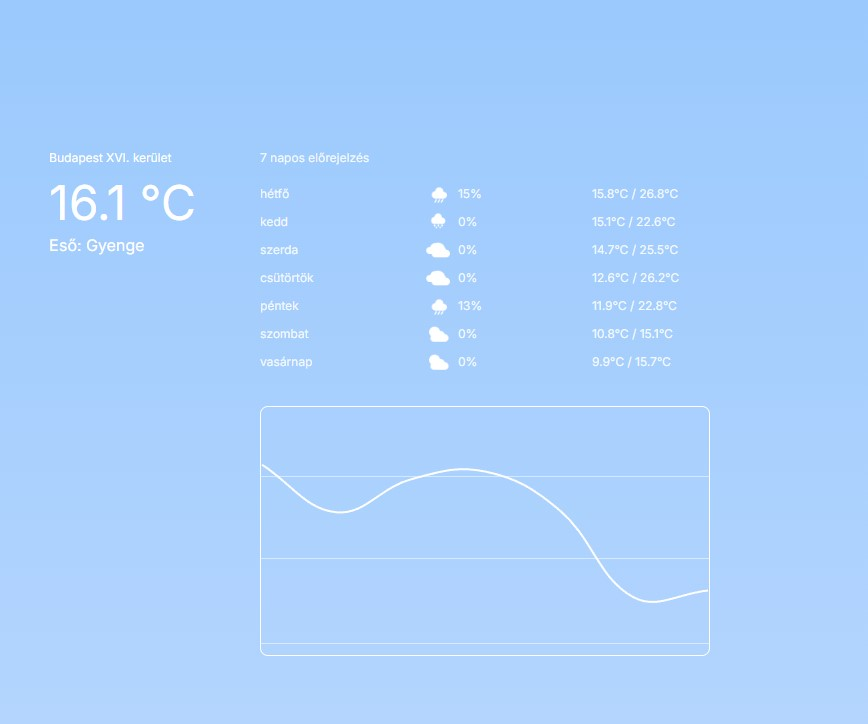

# Weather Forecast Application

## Table of contents
* [General info](#general-info)
* [Description](#description)
* [Screenshot](#screenshot)
* [Technologies](#technologies)
* [Setup & Start](#setup)
* [State](#state)
* [Routes](#routes)
* [To test](#to-test)
* [Directory Structure](#directory-structure)
* [Deploy](#deploy)
* [Created](#created)
* [License](#license)

## General info <a id="general-info"></a>

A weather forecast web application built with React, Vite.js, and Tailwind CSS that allows users to search for a city and view its current weather and a 7-day forecast.

## Description <a id="description"></a>

This application uses the **Open Meteo API** to fetch weather data based on a selected city. Users can select cities using the geocoding API, view the current weather conditions, and explore a 7-day weather forecast. The app also includes a temperature trend chart.

## Screenshot <a id="screenshot"></a>



## Technologies <a id="technologies"></a>

* Node.js - version 14.x or higher
* React - Frontend Library
* Vite.js - Build tool
* Tailwind CSS - Styling
* Open Meteo API - Weather and geocoding API

## Setup & Start <a id="setup"></a>

* Clone or download the repository:

    ```sh
    git clone https://github.com/your-repository/weather-forecast.git
    ```

* Navigate to the project directory:

    ```sh
    cd weather-forecast
    ```

* Install the required dependencies:

    ```sh
    npm install
    ```

* Start the development server:

    ```sh
    npm run dev
    ```

* Open the app in your browser at:

    ```plaintext
    http://localhost:3000
    ```

## State <a id="state"></a>

The application's state is managed with React's `useState` and `useEffect` hooks. The state includes:
- **Selected City**: The city chosen by the user via the `CitySelector` component.
- **Weather Data**: The current weather and 7-day forecast for the selected city.

## Routes <a id="routes"></a>

- `/` – Main page where users can search for a city and view its weather information.

## To Test <a id="to-test"></a>

1. Select a city using the search bar.
2. View the current weather for the city.
3. Explore the 7-day weather forecast and view the temperature chart.

## Directory Structure <a id="directory-structure"></a>

```plaintext
/weather-forecast
├── public
│   ├── favicon.ico
│   └── index.html
├── src
│   ├── assets
│   │   ├──
│   │   └──
│   ├── components
│   │   ├── CitySelector.jsx
│   │   ├── CurrentWeather.jsx
│   │   ├── TemperatureChart.jsx
│   │   └── WeatherForecast.jsx
│   ├── App.jsx
│   ├── index.css
│   └── main.jsx
├── .gitignore
├── package.json
├── postcss.config.js
├── tailwind.config.js
└── vite.config.js
```

## Deploy <a id="deploy"></a>

You can deploy this application using **Surge**:

* Install Surge globally:

    ```sh
    npm install --global surge
    ```

* Build the project for production:

    ```sh
    npm run build
    ```

* Deploy the build folder:

    ```sh
    surge ./dist
    ```

* Check out Surge's [documentation](https://surge.sh/) for more details.

## Created <a id="created"></a>

2024

## License <a id="license"></a>

MIT License
